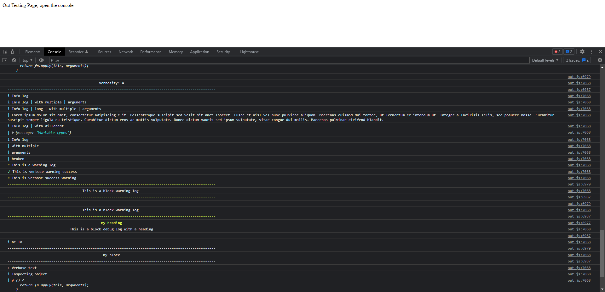

# @snickbit/out

Cross-platform pretty output for your terminal or browser console.

## Installation

```bash
yarn add @snickbit/out
```

```bash
npm add @snickbit/out
```

## Usage

Simply import the `out` function and call it with your message.

```js
import out from '@snickbit/out'

// Multiple import/require options
// import {out} from '@snickbit/out';
// const out = require('@snickbit/out');

out('Standard out')
out.info('Info log')
out.info('Info log', 'with multiple', 'arguments')
out.info('Info log', 'long', 'with multiple', 'arguments', 'Lorem ipsum dolor sit amet, consectetur adipiscing elit. Pellentesque suscipit sed velit sit amet laoreet. Fusce et nisl vel nunc pulvinar aliquam. Maecenas euismod dui tortor, ut fermentum ex interdum ut. Integer a facilisis felis, sed posuere massa. Curabitur suscipit semper ligula eu tristique. Curabitur dictum eros ac mattis vulputate. Donec dictum mauris sed ipsum vulputate, vitae congue dui mollis. Maecenas pulvinar eleifend blandit.')
out.info('Info log', 'with different', {message: 'Variable types'})
out.info.broken.log('Info log', 'with multiple', 'arguments', 'broken')
out.warn('This is a warning log')
out.verbose.warn.success('This is verbose warning success')
out.verbose.success.warn('This is verbose success warning ')
out.block.warn('This is a block warning log')
out.block.warn('This is a block warning log')
out.block.heading('my heading').debug('This is a block debug log with a heading')
out.heading('non block heading').info('hello')
out.block('my block')
out.verbose.text('Verbose text')
out.info('Inspecting object', out)
```

### Browsers

In browsers, you just need to include it in your document somewhere and an instance of `out` is created and attached to the `window` object so it can be used globally in most environments.

```html
<html lang="en">
	<head>
		<script src="../lib/index.js" type="text/javascript"></script>
		<title></title>
	</head>
	<body>
		<div>My Out testing page</div>
		<script lang="js">
			out.write('Hello, world!')
			window.out.info('I love out!')
		</script>
	</body>
</html>
```

## Browser



## Terminal


## License

Copyright (c) 2022 - **Nicholas Lowe** aka **Snickbit**

[MIT License](https://github.com/snickbit/snickbit.js/blob/master/LICENSE)
